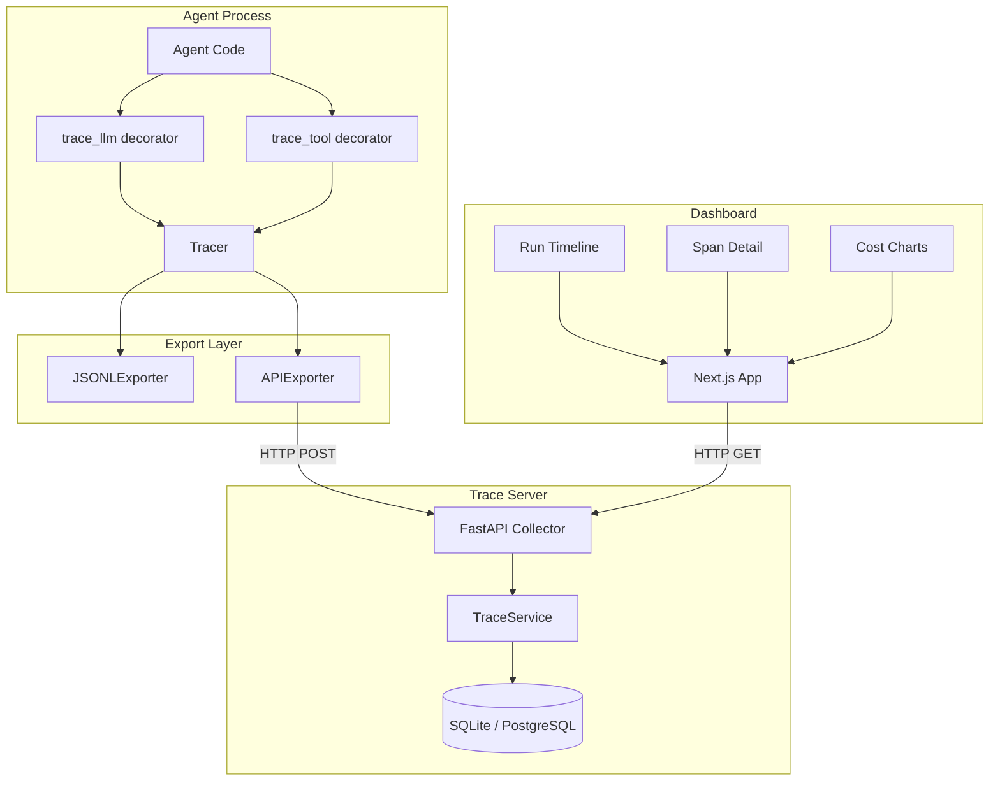

# Architecture

## System Overview

AgentTrace follows a three-tier architecture: SDK → Server → Dashboard.



## Data Flow

```
1. Agent calls trace_llm(prompt) or trace_tool(fn)
2. SDK creates a Span, records start_time
3. Original function executes
4. SDK records output, end_time, cost, tokens
5. Span is exported via configured exporter
6. APIExporter POSTs runs to `/api/runs` and spans to `/api/traces`
7. Server validates and persists to database
8. Dashboard queries /api/runs and /api/traces
9. User inspects timeline, spans, costs
```

## Component Responsibilities

### SDK (`sdk/agenttrace/`)
- **Tracer**: Manages run lifecycle, creates spans, coordinates exporters
- **Span**: Immutable record of a single operation (LLM call, tool call, decision)
- **RunContext**: Thread-local/context-var state for nested span tracking
- **Exporters**: Pluggable output — JSONL file, HTTP API, or custom
- **Wrappers**: Decorators that auto-instrument LLM and tool calls

### Server (`server/app/`)
- **API Layer**: REST endpoints for trace ingestion and querying
- **Service Layer**: Business logic for cost calculation, token aggregation
- **Data Layer**: SQLAlchemy async models with Pydantic validation
- **Config**: Environment-based configuration via pydantic-settings

### Dashboard (`dashboard/`)
- **Run List**: Paginated table of all runs with status and cost
- **Run Detail**: Timeline visualization of spans within a run
- **Span Inspector**: Input/output payloads, metadata, timing
- **Analytics**: Cost breakdown and token usage charts
