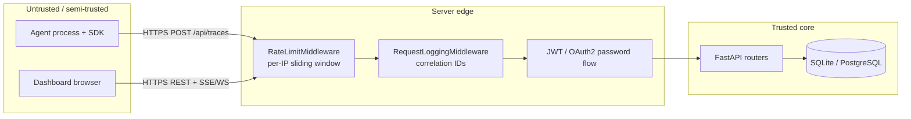
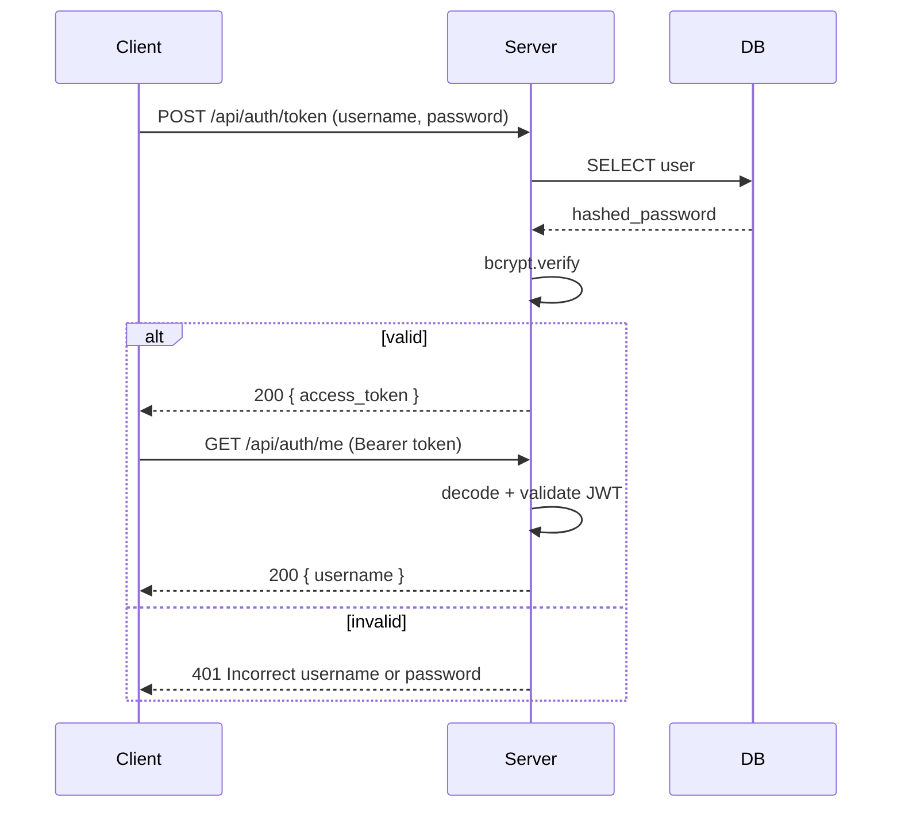

# Security Guide

AgentTrace handles agent telemetry — prompts, tool I/O, model costs — which can
contain sensitive data. This guide covers the trust boundaries, authentication,
secrets handling, and the hardening checklist for the **server** and **dashboard**.
The **SDK** runs inside the user's own process and never holds credentials of its
own beyond the optional collector URL/token.

## Trust boundaries



Everything left of the edge is untrusted. The edge applies rate limiting,
request-correlation logging, and authentication before any handler touches the
database. Ingestion endpoints accept an **optional** bearer token
(`get_optional_user`) so a collector can run open inside a private network or be
locked down at the perimeter.

## Secrets management

### Environment variables

All secrets are loaded from environment variables; nothing is committed.

```bash
cp .env.example .env
# Edit with your secrets
```

| Variable | Purpose | Default |
|----------|---------|---------|
| `DATABASE_URL` | Database connection (SQLite or PostgreSQL) | `sqlite+aiosqlite:///./data/agenttrace.db` |
| `SECRET_KEY` | JWT signing key — **must** be overridden in production | `your-secret-key-change-in-production` |
| `CORS_ORIGINS` | Allowed dashboard origins (comma-separated) | `*` (open — restrict in prod) |
| `REDIS_URL` | Backing store for multi-worker rate limiting | unset (in-memory) |
| `OPENAI_API_KEY` | LLM API (optional, only for real-mode demos) | unset |
| `ANTHROPIC_API_KEY` | Anthropic API (optional, only for real-mode demos) | unset |

### Authentication

- User passwords are hashed with **bcrypt** before storage (`app/auth.py`).
- **JWT** bearer tokens authenticate API calls; tokens expire after
  `ACCESS_TOKEN_EXPIRE_MINUTES`.
- A demo user (`admin` / `admin123`) is seeded on first startup for local use —
  **change or disable this in production.**



## Data exposure considerations

- **Prompt / tool payloads** are stored verbatim in `trace_input` / `trace_output`.
  Treat the trace database as sensitive. Redact upstream in the SDK if payloads
  may contain PII or secrets.
- **Cost / OTLP export** (`GET /api/otlp/v1/traces`) exposes span metadata and
  cost attributes. Put it behind the same auth / network controls as the
  dashboard API when traces are sensitive.
- **Demo mode** (dashboard) only ever serves bundled fixtures — it never proxies
  or leaks real backend data, so it is safe to ship in public previews.

## Cross-service ingestion hardening

The shared-span (`/api/traces/spans`), cost-record (`/api/traces/costs`), and
OTLP push (`POST /api/otlp/v1/traces`) endpoints accept data from *other*
services (e.g. `hermes-agent-framework`). They:

- auto-create only placeholder run rows (no privilege-escalation surface);
- take cost verbatim and never execute inbound content;
- are rate-limited and correlation-logged like every other route.

In a multi-tenant deployment, require a bearer token on these routes and scope
each producer to its own network segment.

## Security checklist

- [ ] Override `SECRET_KEY` with a strong random value.
- [ ] Change or remove the default demo password (`admin` / `admin123`).
- [ ] Use PostgreSQL instead of SQLite for production durability.
- [ ] Restrict `CORS_ORIGINS` to known dashboard domains (default is `*`).
- [ ] Terminate TLS at the edge (reverse proxy / ingress).
- [ ] Set `REDIS_URL` so rate limiting is enforced across all workers.
- [ ] Require auth on ingestion + OTLP routes in shared / multi-tenant deployments.
- [ ] Database not exposed publicly; restrict to the server's network.
- [ ] Redact sensitive prompt / tool payloads at the SDK before export.
