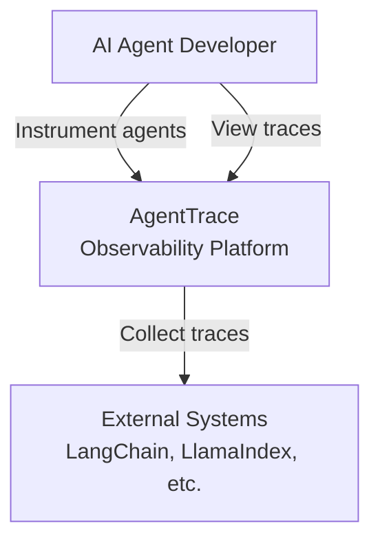
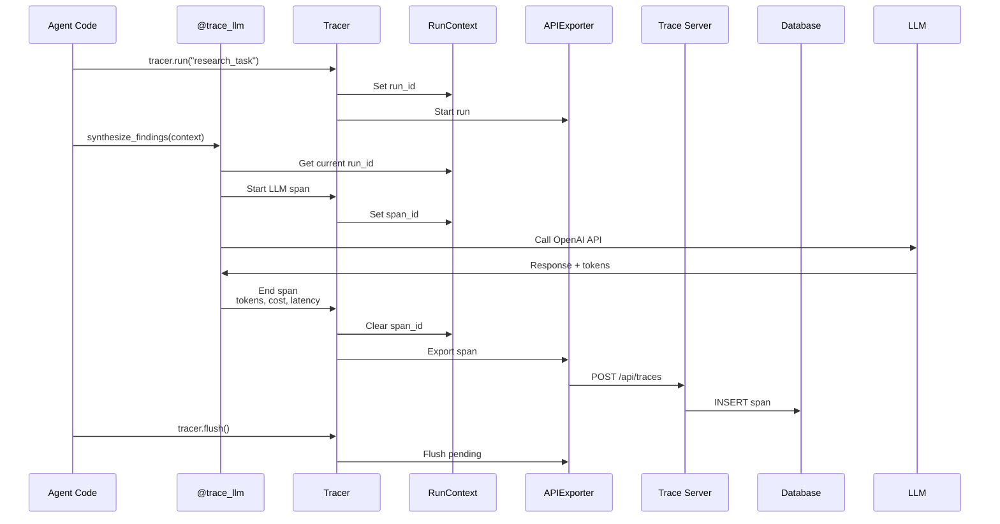

# AgentTrace Architecture (C4 Model)

## Context Diagram (C4 Level 1)



## Container Diagram (C4 Level 2)

```mermaid
graph TB
    subgraph Agent[System Under Observation]
        AgentCode[Agent Code<br/>Python]
        SDK[AgentTrace SDK<br/>Python Library]
    end

    subgraph Platform[AgentTrace Platform]
        Server[Trace Server<br/>FastAPI, SQLAlchemy<br/>Port 8000]
        Dashboard[Dashboard<br/>Next.js, Recharts<br/>Port 3000]
        Database[(PostgreSQL / SQLite)]
    end

    OTLP[OTLP Consumer<br/>OpenTelemetry]

    AgentCode -->|trace_llm()| SDK
    AgentCode -->|trace_tool()| SDK
    SDK -->|HTTP Export| Server
    SDK -->|OTLP Export| OTLP
    Server -->|Store/Query| Database
    Dashboard -->|REST API| Server
```

## Component Diagram (C4 Level 3) - SDK

```mermaid
graph TB
    subgraph SDK[AgentTrace SDK]
        Tracer[Tracer<br/>Run/Span Management]
        Context[RunContext<br/>contextvars]
        Wrappers[@trace_llm<br/>@trace_tool]

        subgraph Exporters[Exporters]
            JSONL[JSONLExporter<br/>Local files]
            HTTP[APIExporter<br/>HTTP POST]
            OTLP[OTLPExporter<br/>OpenTelemetry]
        end

        Wrappers --> Tracer
        Tracer --> Context
        Tracer --> Exporters
    end

    subgraph Models[Data Models]
        Run[Run<br/>ID, timestamps, correlation]
        Span[Span<br/>Type, I/O, tokens, cost]
    end

    Tracer --> Run
    Tracer --> Span
```

## Data Flow - Trace Collection



## Key Architectural Decisions

| Decision | Rationale |
|----------|-----------|
| **Span-based Model** | OpenTelemetry-compatible; composable and nestable |
| **Context Variables** | Thread-safe and asyncio-safe state management |
| **Decorator Wrappers** | Minimal code changes to instrument existing agents |
| **Multiple Exporters** | Flexibility: local files for dev, HTTP for production |
| **Separate Server** | Decouples tracing from execution; enables real-time dashboard |
| **Correlation IDs** | Track distributed multi-agent workflows |

## Technology Stack

| Layer | Technology |
|-------|------------|
| SDK | Python 3.11+, Pydantic, contextvars |
| Server | FastAPI, SQLAlchemy 2.0, asyncpg |
| Database | PostgreSQL 16 / SQLite |
| Dashboard | Next.js 14, React, Recharts, Tailwind |
| Protocol | OpenTelemetry OTLP (compatible) |

## Performance Characteristics

| Metric | Target |
|--------|--------|
| SDK overhead | <1ms per span |
| Export batch size | 100 spans default |
| Export interval | 5 seconds |
| Dashboard load | <100ms for 1000 runs |
| Trace query | <50ms by run_id |
