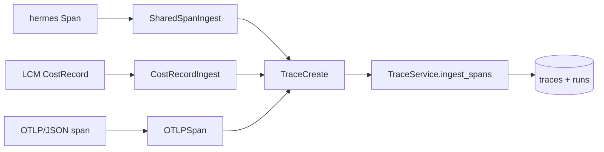

# Design Decisions

Records the decisions made when AgentTrace was migrated onto the `shared_core` standard.
Domain docs: [ARCHITECTURE.md](./ARCHITECTURE.md), [SDK.md](./SDK.md),
[TRACE_SCHEMA.md](./TRACE_SCHEMA.md), [REPLAY.md](./REPLAY.md).

## Decision: keep the SDK standalone and `shared_core`-free

- **Context:** the SDK is the product's centerpiece and is `pip install agenttrace` on its
  own. Coupling it to the workspace's `shared_core` would defeat that.
- **Choice:** only the **server** adopts `shared_core`. The SDK keeps its own `Span` schema
  and `CostTracker.PRICING`. Optional integrations are lazy availability probes.
- **Consequence:** the pricing-consolidation follow-up applies to the server only; the SDK's
  table stays local. A minimal `Span` primitive lives in `shared_core.tracing` (a *copy* of
  the SDK schema) so other Python projects can emit AgentTrace-compatible spans.

## Decision: server infrastructure → `shared_core`

- `Settings(BaseSettings)` → `Settings(BaseAppConfig)`; `core/logging` → `setup_logging`;
  the in-memory rate limiter → `shared_core.ratelimit` (Redis-ready, in-memory fallback);
  the bespoke async engine → `AsyncDatabaseManager` (keeping the local `DeclarativeBase`,
  the SQLite schema-repair, and the demo-user seed). Added `application_error_handler` +
  `RequestLoggingMiddleware`.

## Decision: fix the SDK package-init import cycle

- `agenttrace/__init__.py` imports `instrumentation` before `tracer`; the instrumentation
  modules needed `Tracer` at import time. They now import `from agenttrace.tracer import
  Tracer` (the identical class object), breaking the cycle without behavior change.

## Decision: test route-registration via the OpenAPI schema

- FastAPI ≥0.137 no longer flattens included sub-router routes into `app.routes` (it stores
  `_IncludedRouter` wrappers). The streaming-route registration test now asserts against
  `app.openapi()["paths"]`, which is version-robust.

## Decision: SQLite default, Postgres in compose

- The server defaults to `sqlite+aiosqlite:///./data/agenttrace.db` for zero-config local
  runs; `docker-compose.yml` uses `pgvector/pgvector:pg16`. (This surfaced a `shared_core`
  bug — `to_async_url` double-applied the sqlite rewrite — now fixed and regression-tested.)

## Decision: ingest `shared_core` spans and cost records via adapters, not a rewrite

- **Context:** the convergence goal is for other services on the standard (e.g.
  `hermes-agent-framework`, LCM-style cost emitters) to feed AgentTrace using the canonical
  `shared_core.tracing.Span` / `CostRecord` shapes — *without* changing the server's stored
  schema or any numeric output.
- **Choice:** add thin **adapters** (`app/services/ingest_adapters.py`) that normalize the
  canonical shapes into the existing `TraceCreate`, plus endpoints `POST /api/traces/spans`
  and `POST /api/traces/costs`. Span types/statuses are mapped onto AgentTrace's existing
  vocabulary; unknown values pass through. Cost is taken **verbatim** — the adapters never
  recompute pricing, so existing cost analytics are byte-for-byte unchanged.
- **Consequence:** ingestion flows through the same `TraceService` path as native SDK spans
  (same aggregation, same broadcast). A new `ingest_spans` helper auto-creates placeholder
  runs for foreign `trace_id`s. Adding capability, not altering internals.

## Decision: best-effort OTLP interop (JSON only, no protobuf/gRPC)

- **Context:** OpenTelemetry compatibility is valuable, but a full OTLP collector
  (protobuf + gRPC) is a large surface for a showcase server.
- **Choice:** expose a **JSON subset** — `GET /api/otlp/v1/traces` renders stored spans as
  `ResourceSpans`, and `POST /api/otlp/v1/traces` accepts an `ExportTraceServiceRequest` and
  returns a `partialSuccess` count. AgentTrace cost/token attribution rides as OTLP span
  attributes (`agenttrace.cost_usd`, `llm.model`, `llm.usage.*`) so the export/ingest round-
  trips losslessly.
- **Consequence:** OTel-aware tooling can scrape or push traces today; protobuf/gRPC remain
  an explicit non-goal documented in the roadmap.

## Decision: simple threshold alerting (cost + latency), polled not pushed

- **Choice:** keep alerting as **stateless, on-demand evaluations** — `GET /api/alerts`
  (daily + per-run cost thresholds) and `GET /api/alerts/latency` (per-span latency
  threshold). No background scheduler, no alert store.
- **Rationale:** a polled rule is trivial to test deterministically and composes with any
  external scheduler/notifier. Stateful alert routing is intentionally deferred (roadmap).

## Decision: dashboard demo-mode as a network-failure fallback

- **Context:** the dashboard should be explorable with no backend (previews, screenshots,
  offline dev) without hiding the fact that the data is synthetic.
- **Choice:** the API client falls back to **bundled fixtures** on a GET network error and
  flips a `demoMode` singleton that a visible `DemoModeBanner` subscribes to. `NEXT_PUBLIC_
  DEMO_MODE=1` forces it. Writes are never faked.
- **Consequence:** no error dead-ends; the offline path is honestly labeled; demo data never
  proxies real backend data.
