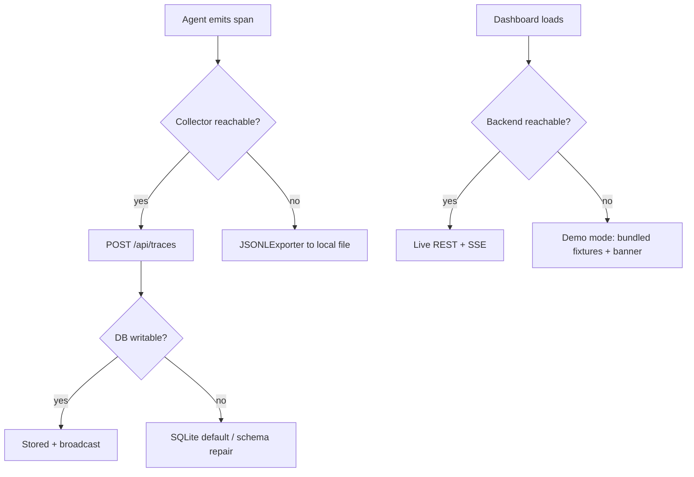

# Failure Modes

This catalog lists the ways AgentTrace degrades, how each failure is detected,
and the mitigation that keeps the system useful. The guiding principle is
**tracing must never break the host agent** and **the dashboard must never show a
dead end** — both have an explicit fallback path.

## Collector server unavailable
- **Cause:** the SDK's `APIExporter` can't reach the server.
- **Detection:** exporter HTTP errors (batched POST with exponential-backoff retry).
- **Mitigation:** the SDK can export to a local JSONL file instead (`JSONLExporter`); the
  offline demo and tests use this path — tracing never blocks the host agent.

## Optional integration not installed
- **Cause:** `auto_instrument` is called but langchain/llamaindex/openai/fastapi isn't present.
- **Detection:** availability-probe imports inside `try/except ImportError`.
- **Mitigation:** the corresponding instrumentor is skipped; the SDK degrades to manual
  tracing. No hard dependency on any provider SDK.

## Database unavailable (server)
- **Cause:** Postgres down (or the local SQLite file is unwritable).
- **Detection:** `init_db()` / health endpoint.
- **Mitigation:** SQLite default needs no service for local runs; the `_repair_sqlite_schema`
  step keeps older local DBs forward-compatible.

## Rate limit exceeded
- **Cause:** a client exceeds the per-IP window.
- **Detection:** `shared_core.ratelimit.RateLimiter` (sliding window).
- **Mitigation:** returns 429. In-memory by default (single process); set `REDIS_URL` and a
  `RedisManager` to make it multi-worker safe.

## WebSocket / SSE disconnects
- **Cause:** client drops during live trace tail.
- **Mitigation:** `close_all_connections()` runs on shutdown; clients resume via
  `last_seen_time`/`last_id` query params on the SSE stream.

## Cost mis-attribution
- **Cause:** unknown model in `CostTracker.PRICING`.
- **Mitigation:** an external pricing-file override; per-trace/workflow/feature attribution
  is preserved.

## Dashboard backend offline
- **Cause:** the trace server is not running or is unreachable from the browser.
- **Detection:** the API client's `fetch` throws a network error.
- **Mitigation:** for read (GET) requests the client falls back to in-memory **demo
  fixtures** (`src/lib/demoData.ts`) and flips into **demo mode**, surfacing a visible
  banner (`DemoModeBanner`). The dashboard stays fully explorable offline; live writes are
  not attempted. Setting `NEXT_PUBLIC_DEMO_MODE=1` forces this path for previews.

## Foreign span / cost record with no run (cross-service ingestion)
- **Cause:** a `shared_core` producer (e.g. `hermes-agent-framework`) or an LCM-style cost
  record references a `trace_id`/`run_id` for which no run row exists yet.
- **Detection:** `TraceService.ingest_spans` checks each referenced run.
- **Mitigation:** a placeholder `running` run is auto-created (`ensure_run_exists`) so
  aggregate stats accrue correctly; a later explicit `POST /api/runs` upserts the real
  metadata. No span is dropped.

## Unknown span type / status from another service
- **Cause:** an inbound `shared_core` span uses a vocabulary AgentTrace does not model.
- **Detection:** the ingestion adapters map known values and pass unknown ones through.
- **Mitigation:** `map_span_type` / `map_span_status` are forward-compatible — unknown
  values are stored verbatim rather than rejected, so new producers never 422.

## OTLP export/ingest mismatch
- **Cause:** an OTLP/JSON document from an external tool uses fields AgentTrace's best-effort
  subset does not parse (protobuf payloads, exotic value types, missing timestamps).
- **Detection:** `_otlp_span_to_trace_create` tolerantly unwraps attribute values and
  timestamps.
- **Mitigation:** unparseable timestamps fall back to "now"; unknown attribute value types
  yield `None`; the push returns a `partialSuccess` count rather than failing the batch.
